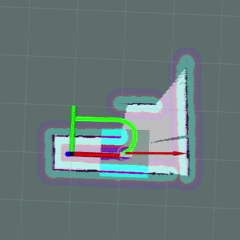

# Autonomous Racing Robot (STM32 + ROS1)

STM32F446RE + ROS1 racing robot: RPLIDAR C1 + IMU, Bluetooth comms, hector_slam mapping, PID motor control, and a custom move_base local planner optimized for high-speed go-and-return navigation via referee node.

> **Author**: [StarDust 星辰涵], Beijing University of Posts and Telecommunications (BUPT)  
> **License**: MIT (see [LICENSE](LICENSE))

## 📑 目录 / Table of Contents

- [Autonomous Racing Robot (STM32 + ROS1)](#autonomous-racing-robot-stm32--ros1)
- [📄 项目说明 / Project Description](#-项目说明--project-description)
- [🎥 演示视频 / Demo Video](#-演示视频--demo-video)
- [🛠 适用场景 / Use Cases](#-适用场景--use-cases)
- [📋 设备清单 / Equipment List](#-设备清单--equipment-list)
- [🔧 消息通信架构 / Communication Architecture](#-消息通信架构--communication-architecture)
- [📂 项目结构 / Project Structure](#-项目结构--project-structure)
- [⚙️ 关键模块说明 / Key Modules Overview](#️-关键模块说明--key-modules-overview)
- [🔁 移植建议 / Porting Guide](#-移植建议--porting-guide)
- [🐞 已知问题 / Known Issues](#-已知问题--known-issues)


---

## 📄 项目说明 / Project Description

<details open>
<summary>🇨🇳 中文说明</summary>

本项目是一个基于双轮差速驱动（辅以万向轮）的自动驾驶竞速小车，通过蓝牙实现 STM32 嵌入式系统与 ROS1（Noetic）上位机的紧密协同。嵌入式端实时采集 RPLIDAR C1 激光雷达与 IMU 数据，接收上位机下发的期望速度指令，执行高响应 PID 电机控制，并通过蓝牙进行双向通信。上位机端采用 `hectorMapping_slam` 实现无里程计的纯激光 SLAM 建图，并对 `move_base` 的局部规划器进行了定制化改造，摒弃传统避障逻辑，专为高速竞速路径跟踪优化。项目还包含一个“裁判节点”，用户只需输入相对于起点的目标坐标，小车即可自动导航至终点并返航。整体设计追求远程透传的slam建图、竞速和精准控制。
</details>

<details>
<summary>🇺🇸 English</summary>

This project presents an autonomous racing robot based on a differential-drive chassis (with a caster wheel), featuring tight integration between an STM32-based embedded system and a ROS1 (Noetic) navigation stack via Bluetooth. The embedded side handles real-time data acquisition from an RPLIDAR C1 and an IMU, executes PID-controlled motor commands based on velocity targets from the host, and communicates bidirectionally over Bluetooth. On the ROS side, `hectorMapping_slam` enables lidar-only SLAM for map building, while a customized local planner in `move_base` is optimized for high-speed racing trajectories—prioritizing path tracking over traditional obstacle avoidance. A dedicated “referee node” allows users to specify a goal coordinate relative to the start point, enabling fully autonomous go-and-return navigation. The overall design aims for transparent SLAM mapping, racing-oriented planning, and precise control.
</details>

---

## 🎥 演示视频 / Demo Video

<details open>
<summary>🇨🇳 中文</summary>

- **完整演示（Bilibili）**: [点击观看视频](https://www.bilibili.com/video/BV18Bs4zBEsY?t=0.1)  
- **快速预览-已经过倍速（GIF）**:

  


</details>

<details>
<summary>🇺🇸 English</summary>

- **Full Demo (Bilibili)**: [Watch on Bilibili](https://www.bilibili.com/video/BV18Bs4zBEsY?t=0.6&p=2)  
- **Quick Preview-times faster (GIF)**:

  


</details>


---

## 🛠 适用场景 / Use Cases

<details open>
<summary>🇨🇳 中文</summary>

本项目遵循**最小化与轻量化设计原则**，代码结构精简，专注于在资源受限条件下完成特定任务。其典型适用场景包括：

- **未知静态迷宫中的自主探索与竞速**：用户只需设定一个相对于起点的目标坐标，小车即可在**无预载地图**的情况下，边通过 `hector_slam` 实时建图，边规划路径前往终点并自动返航。整个过程无需人工干预，适用于封闭、静态但初始未知的赛道环境。
- **远程透传式 SLAM 架构参考**：当激光雷达（如 RPLIDAR C1）部署在嵌入式端（STM32），而 SLAM 与导航计算需在远程 ROS1 主机完成时，本项目提供了一套基于蓝牙的低延迟、双向透传通信方案，可作为**嵌入式传感器 + 远程计算平台**协同系统的参考实现。
- **教学或竞赛原型开发**：适合用于机器人学、嵌入式系统与 ROS 集成的教学演示，或作为“起点-目标-返航”类竞速任务的快速原型基础。

> ⚠️ **注意事项**：  
> 本项目**未实现动态障碍物避障**——为提升竞速性能，代价地图已移除代价的实时更新与滤波机制，因此仅适用于**静态环境**（无移动障碍物）。  
> 若无需蓝牙透传、可直接通过串口连接雷达与主机，推荐使用官方 [rplidar_ros](https://github.com/Slamtec/rplidar_ros) 驱动，其稳定性与兼容性更佳。

</details>

<details>
<summary>🇺🇸 English</summary>

This project follows a **minimalist and lightweight design philosophy**, with streamlined code focused on accomplishing specific tasks under resource constraints. It is best suited for the following scenarios:

- **Autonomous exploration and racing in unknown static mazes**: Users only need to specify a goal coordinate relative to the starting point. The robot will then **autonomously explore, build a map in real time using `hector_slam`**, navigate to the goal, and return—**without requiring a pre-loaded map**. This makes it ideal for closed, static environments that are initially unknown.
- **Reference implementation for remote SLAM via transparent transmission**: When the LiDAR (e.g., RPLIDAR C1) is mounted on an embedded platform (STM32) while SLAM and navigation run on a remote ROS1 host, this project provides a low-latency, bidirectional Bluetooth-based transparent communication framework. It serves as a practical reference for **embedded sensor + remote compute** architectures.
- **Educational or competition prototyping**: Useful for teaching ROS-embedded integration, SLAM, and autonomous navigation, or as a rapid prototype for “go-to-goal-and-return” robotics challenges.

> ⚠️ **Note**:  
> This project **does not support dynamic obstacle avoidance**. To maximize racing performance, the costmap disables real-time cost updates and filtering. Therefore, it is **only suitable for static environments** (no moving obstacles).  
> If a direct serial connection between LiDAR and host is feasible (i.e., no Bluetooth relay needed), the official [rplidar_ros](https://github.com/Slamtec/rplidar_ros) driver is a more robust and maintainable choice.

</details>

---

## 📋 设备清单 / Equipment List

<details open>
<summary>🇨🇳 中文</summary>

- NUCLEO-F446RE Nucleo-64 开发板  
- MPU6050 6DOF 六轴 6 轴姿态加速度传感器模块(I2C)  
- HC-04 初学者套餐
- RPLIDAR C1 思岚 C1 激光雷达 + 转接线 + 安装支架  
- ATB236 双路驱动模块+12V 2550mAh 锂电池 3C 充电器套件【焊接排针】  
- MCS20 带霍尔编码器(L:30 减速比) + 圆形三轮车底盘  
- 杜邦线 20cm（40P/排/公对公）  
- 电机 ph2.0 线连接 ATB236 驱动板 PH2.0 转 XH2.54  
- 建图导航围栏道具（100 PCS）  
- 收纳盒大号智能小车通用  
- 平头螺丝 M2.5×8-头径 5  
- 单头铜柱 M2.5×10+6 固定 8236 驱动板  
- 单头铜柱 M2.5×50+5 固定雷达  
- 平头 M3×12  
- 六角螺帽 M3  
- 双通铜柱 M3×30 固定开发板  
- L 型固定 L30 固定开发板  

</details>

<details>
<summary>🇺🇸 English</summary>

- NUCLEO-F446RE Nucleo-64 Development Board  
- MPU6050 6DOF 6-axis Attitude and Acceleration Sensor Module (I²C)  
- HC-04 Beginner Kit
- RPLIDAR C1 Slamtec LiDAR + Adapter Cable + Mounting Bracket  
- ATB236 Dual Motor Driver Module + 12V 2550mAh Lithium Battery + 3C Charger Kit [Soldered Headers]  
- MCS20 Motor with Hall Encoder (L:30 Gear Ratio) + Round 3-Wheel Robot Chassis  
- 20cm Dupont Jumper Wires (40-pin/strip, male-to-male)  
- Motor PH2.0 Cable Connector for ATB236 Driver (PH2.0 to XH2.54 adapter)  
- Mapping & Navigation Barrier Props (100 pcs)  
- Large Storage Box (Universal for Smart Robot Car)  
- Flat-head Screw M2.5×8 (Head Diameter: 5mm)  
- Single-end Brass Standoff M2.5×10+6 (for securing 8236 driver board)  
- Single-end Brass Standoff M2.5×50+5 (for mounting LiDAR)  
- Flat-head Screw M3×12  
- Hex Nut M3  
- Dual-end Brass Standoff M3×30 (for mounting development board)  
- L-shaped Bracket L30 (for securing development board)  

</details>


---

## 🔧 消息通信架构 / Communication Architecture

<details open>
<summary>🇨🇳 中文</summary>

本项目采用**极简透传通信模型**，实现 STM32 嵌入式系统与 ROS1 主机之间的单向传感器上传与单向控制指令下发。整个系统**无里程计、无闭环反馈**，所有 SLAM 与导航计算均在 ROS 端基于纯激光数据完成。下图为系统消息流结构示意图。

  
*图：系统整体消息流与模块交互关系*

### 📡 通信流程说明：

1. **雷达数据透传（STM32 → ROS）**：
   - RPLIDAR C1 输出的原始十六进制激光数据流，由 STM32 直接读取；
   - STM32 **不解析雷达协议**，仅在原始数据前添加自定义通信帧头（如起始标志、长度字段），通过蓝牙**透明透传**至 ROS 主机；
   - ROS 端的 `/radar_parser_node` 负责帧同步、去头、解析原始数据，并发布标准 `/scan` 消息供 `hector_slam` 使用。

2. **速度指令下发（ROS → STM32）**：
   - 用户设定目标点后，定制版 `move_base` 输出期望的 `/cmd_vel` Twist 消息；
   - `/velocity_parser_node` 将轮速打包为轻量指令帧（左右轮速），通过蓝牙发送至 STM32；
   - STM32 接收后直接驱动电机执行 PID 控制，**不回传任何状态或里程计信息**。

3. **无闭环设计**：
   - 嵌入式端**完全屏蔽里程计数据的收发**，不采集编码器、不计算位姿；
   - ROS 端使用 `hector_slam` 实现**无里程计 SLAM**（laser-only），不依赖 `/odom`；
   - 整个系统为**开环控制架构**，依赖高精度激光建图与路径跟踪，适用于静态、已知或可探索的迷宫环境。

> ✅ 该设计大幅降低嵌入式负载与通信开销，专注于**远程透传 + 主机端 SLAM + 高速路径跟踪**，契合轻量化竞速场景。

</details>

<details>
<summary>🇺🇸 English</summary>

This project adopts a **minimalist transparent transmission model**, enabling unidirectional sensor data upload and unidirectional control command download between the STM32 embedded system and the ROS1 host. The system operates **without odometry and without closed-loop feedback**—all SLAM and navigation are performed on the ROS side using laser-only data. The diagram below illustrates the complete message flow.

  
*Figure: System-wide message flow and module interaction*

### 📡 Communication Flow:

1. **LiDAR Data Transparent Transmission (STM32 → ROS)**:
   - The raw hexadecimal data stream from RPLIDAR C1 is read directly by STM32;
   - STM32 **does not parse the LiDAR protocol**. Instead, it prepends a custom frame header (e.g., start flag, length field) and forwards the data **transparently over Bluetooth** to the ROS host;
   - On the ROS side, `/radar_parser_node` performs frame synchronization, header stripping, and protocol parsing, then publishes standard `/scan` messages for `hector_slam`.

2. **Velocity Command Downlink (ROS → STM32)**:
   - After a goal is set, the customized `move_base` outputs desired `/cmd_vel` Twist messages;
   - `/velocity_parser_node` packs these velocities into lightweight command frames(left/right wheel velocities) and sends them via Bluetooth to STM32;
   - STM32 receives the commands and directly drives the motors using PID control, **without sending back any status or odometry data**.

3. **Open-Loop Design**:
   - The embedded side **completely disables odometry transmission and reception**—no encoder reading, no pose estimation;
   - ROS uses `hector_slam` for **odometry-free SLAM** (laser-only), with no reliance on `/odom`;
   - The entire system operates in an **open-loop control mode**, relying on accurate laser-based mapping and high-speed path tracking, making it suitable for static or explorable maze environments.

> ✅ This design significantly reduces embedded workload and communication overhead, focusing on **remote transparent transmission + host-side SLAM + high-speed path tracking**, ideal for lightweight racing scenarios.

</details>

---


## 📂 项目结构 / Project Structure

<details open>
<summary>🇨🇳 中文</summary>

```text
autonomous-car-project/
├── .gitignore
├── README.md
├── LICENSE
├── embedded/               # STM32CubeMX + Keil MDK 项目
│   ├── APP/                # 外设代码文件
│   ├── Core/               # 主程序main函数
│   ├── MDK-ARM/            # keil项目入口
│   └── MPU6050.ioc         # CubeMX 配置文件
├── ros_ws/
│   └── src/
│       ├── blue_teeth_pkg  # 蓝牙通信 + 雷达解析 + 控制中枢
│       ├── hector_nav_demo # SLAM + 导航
│       └── remoter_pkg     # 自定义键盘遥控
│       └── my_planner      # 自定义局部规划器 + 裁判节点
└── assets/                 # 图片、GIF 等资源
```

</details>

<details>
<summary>🇺🇸 English</summary>

```text
autonomous-car-project/
├── .gitignore
├── README.md
├── LICENSE
├── embedded/               # STM32CubeMX + Keil MDK project
│   ├── APP/                # Peripheral driver code
│   ├── Core/               # Main application (main function)
│   ├── MDK-ARM/            # Keil project entry point
│   └── MPU6050.ioc         # CubeMX configuration file
├── ros_ws/
│   └── src/
│       ├── blue_teeth_pkg  # Bluetooth + radar parsing + control hub
│       ├── hector_nav_demo # SLAM + navigation
│       ├── remoter_pkg     # Custom keyboard teleoperation
│       └── my_planner      # Custom local planner + referee node
└── assets/                 # Images, GIFs
```

</details>

---

## ⚙️ 关键模块说明 / Key Modules Overview

<details open>
<summary>🇨🇳 中文</summary>

### 嵌入式端（STM32F446RE）


### ROS1 上位机

</details>

<details>
<summary>🇺🇸 English</summary>

### Embedded Side (STM32F446RE)


### ROS1 Host

</details>

---

## 🔁 移植建议 / Porting Guide

<details open>
<summary>🇨🇳 中文</summary>

本项目分为 嵌入式下位机 与 ROS1 上位机 两部分，各自有独立的移植说明：
- 📌 [嵌入式系统移植指南（中文）](embedded/README.md#chinese)
- 📌 [ROS1 上位机移植指南（中文）](ros_ws/README.md#chinese)

请根据你的开发目标选择对应文档。

</details>

<details>
<summary>🇺🇸 English</summary>

This project consists of two parts: Embedded (lower-level) and ROS1 (upper-level). Each has its own porting guide:
- 📌 [Embedded System Porting Guide (English)](embedded/README.md#english)
- 📌 [ROS1 Upper-Level Porting Guide (English)](ros_ws/README.md#english)

Please refer to the relevant documentation based on your development target.

</details>

---

## 🐞 已知问题 / Known Issues

<details open>
<summary>🇨🇳 中文</summary>


</details>

<details>
<summary>🇺🇸 English</summary>


</details>

---

